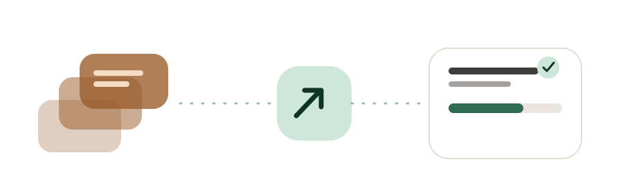
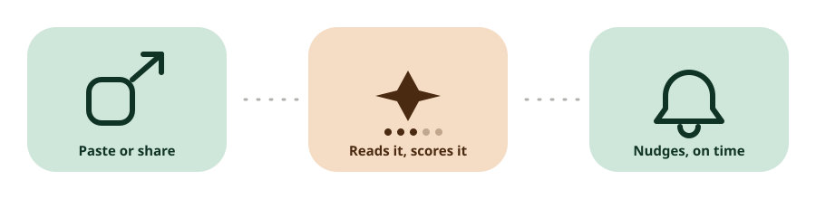

<p align="center">
  
</p>

<h1 align="center">UpWise</h1>
<p align="center">A personal fix for a very specific bad habit.</p>

---

I'm a final-year B.Tech student, and for years my "learning plan" was a Telegram chat with myself full of YouTube videos, Instagram reels, and articles I *meant* to get to. Some weeks that chat grew by fifty links. I opened maybe three of them. It wasn't a resource problem — I had plenty to learn from — it was that saving something felt like progress, so I never had to reckon with whether I'd actually learn it.

UpWise is what I built to stop doing that. There's no "save for later" anymore, only "save and get told the truth about it." Paste a link (or share it straight from the YouTube/Instagram app), and it gets read — not just filed. It tells you what it actually teaches, how long it *really* takes, whether it overlaps with something you already know, and when you're the kind of tired that "watch later" was covering for.

<p align="center">
  
</p>

## What it actually does

- **Reads before it saves.** YouTube transcripts, Instagram reel audio (via Whisper), or article text (with a real readability fallback, not just a title guess) all get fed to an LLM that writes an honest summary, key concepts, difficulty, and a realistic time estimate — not the raw video length.
- **Tells you when you're duplicating effort.** If a new save covers ground something in your library already does, it says so, with a one-tap "skip, I know this."
- **Nudges at the times you actually learn**, not a fixed schedule — quick actions (skip, snooze) right in the notification, nothing to open just to dismiss.
- **Never lets a zero-effort tap count as "learned."** Marking something done always asks for an honest few minutes; the stats are only as real as that number.
- **Knows when to leave you alone.** Declare a break and the streak logic treats those days as neutral instead of punishing you, notifications go quiet, and Home stops pushing a progress bar at you.
- **Surfaces the backlog instead of hiding it.** Anything sitting untouched for two weeks gets an explicit keep/skip/delete prompt instead of just growing forever.

Built with Material 3's tonal system for the UI — one sage accent, one warm accent, surfaces that step by tone instead of borders, no stock icons.

## Stack

Tauri v2 + React/TS for a single Windows + Android codebase, Rust for the native side (the YouTube transcript fetch specifically has to happen *on-device* — YouTube blocks datacenter IPs, so the edge function can't do it). Supabase for Postgres + Edge Functions, Groq for the LLM and Whisper transcription. No login screen — a single built-in account unlocks with a short PIN on first launch, derived client-side into the real password and never stored.

## Setup (once)

```bash
cp .env.example .env        # fill in Supabase URL/key + your account email
npm install
npx supabase link --project-ref <ref>
npx supabase db push
npx supabase secrets set GROQ_API_KEY=... YOUTUBE_API_KEY=...
npx supabase functions deploy analyze-link --no-verify-jwt
npx supabase functions deploy coach --no-verify-jwt
node scripts/set-pin.mjs <your-pin>   # sets the account's real password from a PIN
```

## Develop

```bash
npm run tauri dev                                                    # desktop
npm run tauri android build -- --debug --apk --target aarch64 --ci   # debug APK
```

## Releasing a new version (this is how both apps update)

1. Bump the version in `src-tauri/tauri.conf.json`, `package.json`, and `src-tauri/Cargo.toml`.
2. Commit, then tag and push:
   ```bash
   git tag v0.5.0 && git push && git push --tags
   ```
3. GitHub Actions (`.github/workflows/release.yml`) builds the Windows installer + `latest.json` and the signed Android APK, and attaches them to a GitHub Release.
4. **Windows** app: checks `latest.json` on launch / from Settings → downloads, verifies the signature, installs, relaunches.
5. **Android** app: checks the GitHub Releases API → "Update available" → downloads the APK → tap to install over the current version (same signing key, so data is kept).

### Secrets the workflow needs

Repository → Settings → Secrets and variables → Actions:

| Secret | Value |
|---|---|
| `VITE_SUPABASE_URL`, `VITE_SUPABASE_ANON_KEY`, `VITE_APP_NAME`, `VITE_APP_EMAIL` | same as your `.env` (no password secret — the app never ships one) |
| `TAURI_SIGNING_PRIVATE_KEY` | contents of `~/.upwise-keys/updater.key` |
| `TAURI_SIGNING_PRIVATE_KEY_PASSWORD` | empty |
| `ANDROID_KEYSTORE_BASE64` | `base64 -w0 ~/.upwise-keys/upwise-release.jks` |
| `ANDROID_KEYSTORE_PASSWORD`, `ANDROID_KEY_PASSWORD` | from `~/.upwise-keys/keystore.properties` |
| `ANDROID_KEY_ALIAS` | `upwise` |

**Back up `~/.upwise-keys/`.** Lose the updater key and Windows can't auto-update; lose the keystore and Android can't update in place.

## Layout

```
src/                   React app (screens, components, lib)
src-tauri/              Rust side: plugins + YouTube transcript fetcher
src-tauri/gen/android    Android project (share-sheet intent in MainActivity.kt)
supabase/migrations     Postgres schema (RLS on everything)
supabase/functions      analyze-link (metadata + Groq + Whisper), coach (what to learn now)
```
